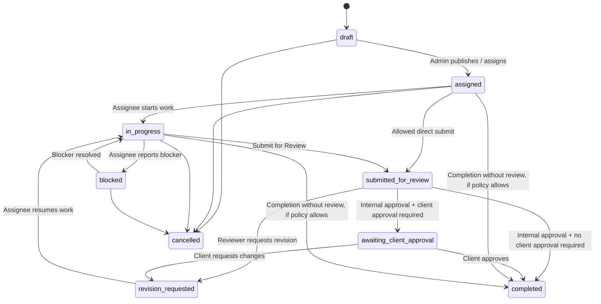

# NawAra CPM — جریان کاری Task و Approval

**وضعیت:** مبنای مورد تأیید برای پیاده‌سازی
**هدف:** مدیریت Taskهای ساختمانی با یک یا چند کارمند، review داخلی، approval اختیاری Client و اتصال کنترل‌شده به progress پروژه.

---

## 1. اصول اصلی

1. هر Task همیشه به یک Project متصل است.
2. Task می‌تواند به یک Section و در صورت نیاز به یک Section Item متصل باشد.
3. Admin هنگام ایجاد Task تعیین می‌کند یک نفر یا چند نفر روی آن کار کنند.
4. کارمند هیچ‌وقت بدون policy مربوط، completion نهایی را تعیین نمی‌کند.
5. هر تغییر status، assignment، deadline، file یا comment در Activity Log ثبت می‌شود.
6. همهٔ transitionها باید در Backend validate شوند؛ UI به‌تنهایی مرجع permission نیست.

---

## 2. مدل Assignment

### 2.1 Assignee اصلی و Contributor

هر Task حداقل یک **Responsible Assignee** دارد. Admin می‌تواند Contributorهای اضافی نیز اضافه کند.

```text
Task
├── Responsible Assignee: مسئول اصلی نتیجه
└── Contributors: همکاران همان Task
```

### 2.2 Assignment Mode

Admin هنگام ساخت Task یکی از این modeها را انتخاب می‌کند:

| Mode | کاربرد | شرط ورود به Review |
|---|---|---|
| `single` | یک کارمند مسئول است | همان کارمند submit کند |
| `shared` | چند نفر یک نتیجهٔ مشترک دارند | Responsible Assignee یا Contributor دارای اجازه submit کند |
| `all_assignees_required` | هر عضو سهم مستقل دارد | تمام Assigneeهای لازم submit کنند |

برای `all_assignees_required`، هر member status شخصی دارد:

```text
not_started → in_progress → blocked / submitted
```

Task اصلی فقط پس از submit تمام اعضای لازم وارد مرحلهٔ review می‌شود.

---

## 3. تنظیمات Completion هنگام ایجاد Task

```text
Review Required                  on / off
Require file before submission  on / off
Require comment before submit   on / off
Notify admin on completion      on / off
Affects project progress        on / off
```

### Rule مهم

اگر `Client Approval Required` روشن شود، internal review به‌صورت اجباری فعال است. کار کارمند نباید مستقیم برای Client منتشر شود.

---

## 4. Statusهای رسمی Task

| Status | معنی | چه کسی می‌تواند آن را ایجاد کند |
|---|---|---|
| `draft` | Task هنوز publish نشده است | Admin / Project Admin |
| `assigned` | Task به Assignee داده شده | Admin / Project Admin |
| `in_progress` | کار آغاز شده است | Assignee مجاز |
| `blocked` | کار به دلیل مانع متوقف است | Assignee مجاز / Admin |
| `submitted_for_review` | کارمند نتیجه را برای review فرستاده است | Assignee مجاز |
| `revision_requested` | reviewer اصلاح خواسته است | Reviewer مجاز |
| `awaiting_client_approval` | review داخلی تأیید شده و Client باید تصمیم بگیرد | Admin / system |
| `completed` | همهٔ gateهای لازم عبور شده‌اند | System بعد از policy صحیح |
| `cancelled` | Task لغو شده است | Admin / Project Admin دارای permission |

---

## 5. نمودار اصلی workflow



---

## 6. مسیرهای Completion

### 6.1 Review Required = روشن، Client Approval = خاموش

```text
Employee works
→ Submit for Review
→ Reviewer approves
→ Task Completed
→ optional progress update + notifications
```

### 6.2 Review Required = خاموش، Client Approval = خاموش

```text
Employee works
→ Complete Task
→ Task Completed
→ optional Admin notification
```

### 6.3 Client Approval Required = روشن

```text
Employee works
→ Submit for Review
→ Admin approves internally
→ Admin publishes approved deliverable to Client
→ Awaiting Client Approval
→ Client approves
→ Task Completed
```

اگر Client گزینهٔ `Request Changes` را بزند:

```text
Awaiting Client Approval
→ Revision Requested
→ Team works again
→ Submit for Review
```

---

## 7. Review Policy

هر Task دارای یک یا چند Reviewer انتخابی است.

### نسخهٔ اول

- یک Reviewer یا چند Reviewer تعیین می‌شوند.
- یک approval از reviewer دارای permission برای کامل‌شدن کافی است.
- Admin/Head Engineer همیشه می‌تواند approve یا revision request کند.

### نسخهٔ توسعهٔ بعدی

```text
Approval policy:
○ Any one reviewer approval is enough
○ All reviewers must approve
○ Head Engineer final approval is required
```

---

## 8. Client Publication و Approval

Client هرگز Task داخلی را خودکار نمی‌بیند.

Admin برای هر Task/Deliverable مشخص می‌کند:

```text
Visible to Client               on / off
Client approval required        on / off
Allow client comments           on / off
Allow client file download      on / off
Notify client when published    on / off
```

### Client Decisionها

| Decision | نتیجه |
|---|---|
| `approve` | Task/Deliverable از gate Client عبور می‌کند |
| `request_changes` | Task به `revision_requested` می‌رود |
| `comment` | فقط اگر comment فعال باشد؛ Activity/notification ثبت می‌شود |

اگر comment عمومی خاموش باشد، Admin می‌تواند تعیین کند که هنگام `request_changes` توضیح کوتاه اجباری باشد یا نباشد.

---

## 9. Blocked Workflow

Assignee باید بتواند Task را Blocked کند و علت را ثبت نماید:

```text
Missing input
Waiting for client
Waiting for approval
Dependency not completed
Technical issue
Other
```

وقتی Task Blocked شد:

1. Task در dashboard Admin به‌عنوان risk دیده شود.
2. Responsible Admin notification بگیرد.
3. reminder/escalation تا رفع blocker طبق policy ادامه یابد.
4. فقط Assignee یا Admin مجاز بتواند آن را به `in_progress` برگرداند.

---

## 10. اتصال Task به Progress

Task field زیر را دارد:

```text
Affects Project Progress: on / off
Progress Contribution / Weight: optional
Linked Section / Item: optional
```

### قاعدهٔ نسخهٔ اول

- progress فعلی section/item سیستم NawAra مرجع رسمی باقی می‌ماند.
- فقط Taskهایی که Admin صریحاً مشخص کرده، پس از عبور از تمام approval gateها می‌توانند update progress پیشنهاد یا اعمال کنند.
- `submitted_for_review` هرگز progress رسمی را تغییر نمی‌دهد.
- اگر Client approval required باشد، update progress نهایی بعد از client approval انجام می‌شود، مگر Admin policy دیگری تعیین کرده باشد.

---

## 11. Activityهایی که همیشه ثبت می‌شوند

```text
Task created
Task updated
Assignee added / removed
Deadline changed
Status changed
Task blocked / unblocked
Comment added
File uploaded / removed
Submitted for review
Approved
Revision requested
Published to client
Client approved / requested changes
Completed / cancelled
```

هر event شامل این داده‌هاست:

```text
actor_user_id
project_id
task_id
event_type
previous_value
new_value
created_at
```

---

## 12. معیار پذیرش مرحلهٔ پیاده‌سازی

- [ ] Task تک‌نفره و چندنفره قابل ساخت باشد.
- [ ] modeهای `single`، `shared` و `all_assignees_required` درست کار کنند.
- [ ] policy review برای هر Task قابل تغییر باشد.
- [ ] کارمند نتواند review-required task را مستقیم final-complete کند.
- [ ] Client فقط task/deliverable صریحاً publish‌شده را ببیند.
- [ ] client approval و comment طبق toggleها enforce شوند.
- [ ] همهٔ transitionها در Backend بررسی و در activity log ثبت شوند.
- [ ] هیچ transition غیرمجاز با request مستقیم ممکن نباشد.
